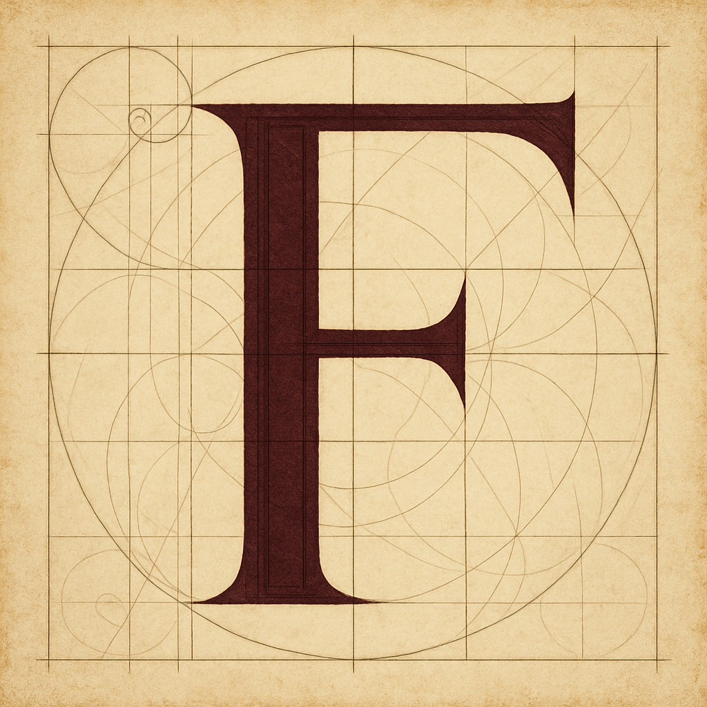

# System Two - Style Guide

*Last updated: March 23, 2026 — v1.2*

---

## Design Philosophy

Classical restraint meets modern web standards. Every element earns its place. The aesthetic references illuminated manuscripts and geometric precision while remaining functional and accessible.

---

## Color Palette

### Primary Colors

| Color | Hex Code | Usage |
|-------|----------|-------|
| **Burgundy** | `#6b2735` | Page titles (H1), illuminated capitals, primary accents, dividers, hover states |
| **Parchment** | `#f5f1e8` | Background color for all pages |
| **Forest Green** | `#2f5233` | Quotes, secondary accents, subtle emphasis |
| **Black** | `#1a1a1a` | Body text, paragraph text, standard content |

### Usage Guidelines

- **Backgrounds:** Always parchment (`#f5f1e8`)
- **Headings:** Burgundy for all heading levels (H1-H6)
- **Body text:** Black (`#1a1a1a`)
- **Quotes/citations:** Forest green, italic
- **Accent borders:** Burgundy at 30% opacity for subtle dividers
- **Never use other greens, blues, or accent colors**

---

## Typography

### Font Stack

**Primary (all content):**
```css
font-family: 'Palatino Linotype', Palatino, 'Book Antiqua', Georgia, serif;
```

**Rationale:** Palatino provides classical elegance, is pre-installed on most systems (zero external requests), has excellent readability at all sizes, and pairs beautifully with illuminated capitals.

### Type Scale

| Element | Size | Weight | Color | Usage |
|---------|------|--------|-------|-------|
| **H1** (Page titles) | 2.5rem (40px) | 500 | Burgundy | One per page, top of content |
| **H2** (Section titles) | 1.75rem (28px) | 500 | Forest Green | Major sections |
| **H3** (Subsections) | 1.25rem (20px) | 500 | Forest Green | Minor sections, closing boxes |
| **Hero names** | 1.5rem (24px) | 500 | Burgundy | Educator names on teaching page |
| **Body text** | 1rem (16px) | 400 | Black | All paragraph content |
| **Page intro** | 1.125rem (18px) | 400 | Dark gray `#2a2a2a` | Opening paragraphs under page title |
| **Quotes** | 1rem (16px) | 400 italic | Forest green | Pull quotes, citations |

### Line Heights

- **Headings:** 1.3 (tighter, more dignified)
- **Body text:** 1.7-1.8 (generous, highly readable)

### Font Weights

- **Regular:** 400 (body text, quotes, most content)
- **Medium:** 500 (headings, emphasis, hero names)
- **Never use:** 600, 700, or bold - too heavy against the aesthetic

### Letter Spacing

- **Default:** Normal (no adjustment)
- **Hero names:** `0.05em` (slightly expanded for gravitas)
- **Page titles:** `-0.02em` (slightly tighter for large sizes)

---

## Layout & Spacing

### Content Width

**Max width:** 800px (centered)

All content containers should be constrained to 800px and centered on the page. This ensures:
- Optimal reading line length (~70 characters)
- Consistent presentation across screen sizes
- Focus on content, not layout gimmicks

### Spacing Scale

Use a consistent rhythm based on rem units:

| Usage | Value |
|-------|-------|
| **Page padding (vertical)** | 3rem |
| **Page padding (horizontal)** | 2rem |
| **Section spacing** | 4rem between major sections |
| **Paragraph spacing** | 1rem between paragraphs |
| **Heading margins (bottom)** | H1: 1.5rem, H2: 1rem, H3: 0.75rem |

### Whitespace Philosophy

**Generous margins like a well-set book page.** Avoid cramming content. When in doubt, add space.

---

## Illuminated Capitals

### Implementation

**Current approach:** PNG image files in `s2_circinus_illuminates/`, displayed in a flex header alongside the scholar name and quote.

```html
<article class="essay-section">
  <div class="essay-header">
    
    <div class="essay-byline">
      <h2 class="scholar-name">Richard Feynman</h2>
      <blockquote class="scholar-quote">"What I cannot create, I do not understand."</blockquote>
    </div>
  </div>
  <div class="essay-body">
    <p>Body paragraphs...</p>
  </div>
</article>
```

**CSS:**
```css
.illuminated-capital {
  width: clamp(5rem, 9vw, 6.5rem);
  height: auto;
  flex-shrink: 0;
  display: block;
}
```

### Design Specifications

- **Style:** Burgundy letter on parchment background, geometric construction grid visible
- **Size:** 120px × 120px on desktop
- **Margin:** 1.5rem right, 1rem bottom (text wraps around)
- **Border:** Optional subtle burgundy border if needed for definition
- **Mobile:** Reduce to 80px × 80px or remove float (center above text)

### Available Letters

**Illuminated capitals (uppercase):** Full alphabet A–Z in `s2_circinus_illuminates/`
Naming convention: `{Letter}_s2_circinus_illuminates.png` — e.g. `F_s2_circinus_illuminates.png`

**Minuscules (lowercase):** Full alphabet a–z in `s2_circinus_miniscules/`
Naming convention: `{letter}_s2_circinus_miniscule.png` — e.g. `f_s2_circinus_miniscule.png`

**To add new letters:** Follow the same geometric construction approach, maintain burgundy/parchment palette, save as PNG at 120px minimum.

---

## Components

### Section Dividers

**Horizontal rules between major sections:**

```css
.section-divider {
  width: 100%;
  height: 1px;
  background: #6b2735;
  opacity: 0.3;
  margin: 4rem 0;
}
```

**Usage:** Between hero essays, between major page sections. Do not overuse.

### Closing Boxes

**For final summaries or calls to action:**

```css
.closing-section {
  margin: 4rem 0 2rem;
  padding: 2rem;
  background: rgba(107, 39, 53, 0.05); /* burgundy tint */
  border-left: 4px solid #6b2735;
  border-radius: 0; /* sharp corners */
}
```

**Typography inside:**
- Title: H3, burgundy
- Text: normal body size, black

### Hero Sections (Essay Format)

**Structure for educator profiles or major content blocks:**

```html
<article class="essay-section">
  <div class="essay-header">
    
    <div class="essay-byline">
      <h2 class="scholar-name">Name</h2>
      <blockquote class="scholar-quote">"Pull quote in forest green italic"</blockquote>
    </div>
  </div>
  <div class="essay-body">
    <p>Body paragraphs...</p>
  </div>
</article>
```

**Capital and byline sit side by side in a flex row. Essay body flows below.**

---

## Navigation

### Header

**Fixed structure:**
- Logomark (left, 60px height)
- Horizontal nav links (right)
- Subtle bottom border (burgundy, 20% opacity)
- Parchment background

**Nav link states:**
- Default: Forest green text
- Hover: Burgundy text
- Current page: Burgundy text, 2px burgundy underline

**Pages in nav:** Engineering, Programmes, Teaching, Contact

**Note:** No "Home" link (logo serves this purpose). No "System Two" text beside logo (redundant).

### Footer

**Minimal:**
- Copyright notice
- Link to "Contact"
- Small text (0.9rem)
- Subtle top border matching header

---

## Responsive Breakpoints

### Desktop (default)
All styles as specified above. Optimized for ≥1024px.

### Tablet (768px - 1024px)
- Reduce padding slightly (2rem vertical, 1.5rem horizontal)
- Nav links remain horizontal but with tighter spacing

### Mobile (< 768px)
- Base font size: 14px (instead of 16px)
- H1: 2rem, H2: 1.5rem, H3: 1.125rem
- Illuminated caps: 80px × 80px
- Nav: Stack vertically or hamburger menu (TBD)
- Padding: 1.5rem vertical, 1rem horizontal

---

## Content Guidelines

### Mini-Essays

**Format used throughout the site for thought pieces:**

- **Word count:** 150-250 words
- **Paragraph count:** 3-4 paragraphs
- **Structure:**
  1. Context (who/what/when) - 2-3 sentences
  2. Core insight/method - 3-4 sentences
  3. How it shapes our work - 3-4 sentences
  4. Takeaway/bridge (optional) - 2 sentences

**Goal:** One viewport = one digestible chunk. Minimize scrolling.

### Tone

- Direct, confident
- No comparative punching ("here's why others are wrong")
- Invitational but not sales-y
- Technical but accessible
- "Here's our thinking" not "here's what you should think"

---

## Technical Standards

### File Organization

```
/
├── index.html
├── teaching.html
├── programmes.html
├── approach.html
├── about.html
├── contact.html
├── css/
│   └── styles.css (single stylesheet)
├── images/
│   └── system2-logomark.png
├── s2_circinus_illuminates/
│   └── {A-Z}_s2_circinus_illuminates.png (full alphabet)
├── s2_circinus_miniscules/
│   └── {a-z}_s2_circinus_miniscule.png (full alphabet)
├── favicons/
│   └── (favicon files)
└── programmes/
    ├── personal-knowledge-model.html
    ├── analytical-foundations.html
    ├── applied-machine-learning.html
    └── bayesian-simulations.html
```

**Pages not yet created:** `domain-focus.html`, `philosophy.html`, `work-with-us.html`

### CSS Approach

- **Single stylesheet:** `css/styles.css` for entire site
- **No preprocessors:** Plain CSS
- **No frameworks:** No Bootstrap, Tailwind, etc.
- **Minimal JavaScript:** Only where genuinely needed

### Performance

- **Target load time:** < 2 seconds
- **Font loading:** System fonts (Palatino) = instant, zero external requests
- **Image optimization:** Compress illuminated capitals, use appropriate formats
- **No external dependencies** except where absolutely necessary

---

## Accessibility

- **Proper heading hierarchy:** H1 → H2 → H3, no skipping levels
- **Alt text** on all images, especially illuminated capitals
- **Color contrast:** WCAG AA compliant (all text readable on parchment bg)
- **Keyboard navigation:** All interactive elements accessible via keyboard
- **No reliance on color alone** to convey meaning

---

## Don'ts (Common Mistakes to Avoid)

- ❌ **Don't use other greens** - only forest green `#2f5233`
- ❌ **Don't use bold (700 weight)** - use medium (500) for emphasis
- ❌ **Don't center body text** - left-align paragraphs and lists
- ❌ **Don't use rounded corners** - keep sharp edges (classical aesthetic)
- ❌ **Don't add drop shadows or gradients** - flat design only
- ❌ **Don't exceed 800px content width** - maintain readability
- ❌ **Don't use emojis or casual elements** - formal, considered tone
- ❌ **Don't add unnecessary animations** - restraint over flash

---

## Examples in Practice

### Good

- Teaching page with three hero essays (Feynman, Halsted, Alcuin)
- Illuminated capitals floating left with wrapped text
- Generous whitespace between sections
- Consistent burgundy headings on parchment background
- Forest green quotes in italic

### Resolved (as of v1.1)

- ~~index.html used wrong green~~ — fixed, all pages now parchment
- ~~index.html used Cormorant Garamond~~ — fixed, Palatino throughout, no external fonts
- ~~Navigation inconsistent across pages~~ — fixed, all pages share the same nav structure

---

## Version History

**v1.2** - March 23, 2026
- Nav restructured: Engineering, Programmes, Teaching, Contact
- Removed "Home" link (logo is the home link) and "System Two" text from logo area
- H2/H3 headings: forest green (H1 remains burgundy)
- Nav links default: forest green
- Removed "How This Works in Practice" section from teaching page
- Footer link updated to "Contact"

**v1.1** - March 23, 2026
- Updated illuminated capitals section: full A–Z alphabet available, actual file paths and CSS classes documented
- Updated file organisation to reflect actual repo structure
- Updated hero section HTML example to match implemented pattern
- Resolved "Needs Updating" items — all pages now on parchment/Palatino with consistent nav

**v1.0** - March 23, 2026
- Initial style guide
- Codified color palette (burgundy, parchment, forest green, black)
- Established Palatino as site-wide typeface
- Defined illuminated capital approach
- Documented spacing and layout standards

---

*This is a living document. Update as design decisions evolve.*
